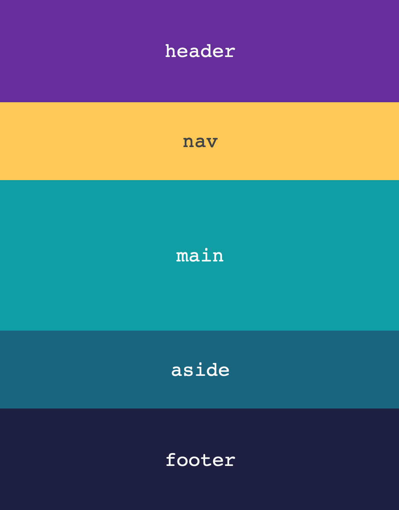

# HTML container elements

Sometimes you want to apply your styles to a group of elements or around a group of elements. The HTML you've learned so far can make this awkward or even impossible. Take [this example](https://codepen.io/angeliquejw/pen/yLNppQV?editors=0100).

If you want the `background-color` in the above example to wrap around all the elements without any gaps, the best way to achieve this is with a container element around your existing elements (just like an `ul` wraps around `li`s). Luckily, there are several HTML elements for this purpose.

## Semantic

Some of the container elements are meaningful and represent the organization of a page.
- [`main`](https://developer.mozilla.org/en-US/docs/Web/HTML/Element/main) represents the main content of a page; a page should only have one `main` element and it should include content unique to the page.
- In comparison, the following elements often include content that is repeated across the pages of a site:
  - [`header`](https://developer.mozilla.org/en-US/docs/Web/HTML/Element/header) is for introductory content
  - [`nav`](https://developer.mozilla.org/en-US/docs/Web/HTML/Element/nav) contains the major navigation links for a site
  - [`aside`](https://developer.mozilla.org/en-US/docs/Web/HTML/Element/aside) is a container for content that is related to the content within `main`
  - [`footer`](https://developer.mozilla.org/en-US/docs/Web/HTML/Element/footer) contains details about its parent element (for example, the copyright details for a page or the author section on a blog post or article).
  - [`section`](https://developer.mozilla.org/en-US/docs/Web/HTML/Element/section) is used if and when you need to break down the content inside a `main` or other element even further (so, a blog post with mutiple headings and content sections could use this). Again, only use `section` if you need it after starting to apply your CSS/styles.

Check out this [updated CodePen example](https://codepen.io/angeliquejw/pen/qBdppQY?editors=0100
) to see how using the `main` element solves the problem with the `background-color`.

As you'll see in the CodePen, the other elements you've already learned can be nested inside these container elements. See [this markup](examples/container-elements.html) for a more robust example.

## Generic
While it's best to use a semantic element, something that adds meaning to your document, sometimes there's no right choice from the existing elements. In those cases, there are two generic container elements that give no extra meaning to your HTML document: `div` and `span`.

To understand when to use `div` or `span`, you need to understand [block vs inline elements](block-vs-inline.md).

Container elements are an awesome feature, but remember to add them on an as-needed basis and to always use a semantic element when psosible.

---

[↤ back](README.md#table-of-contents)
