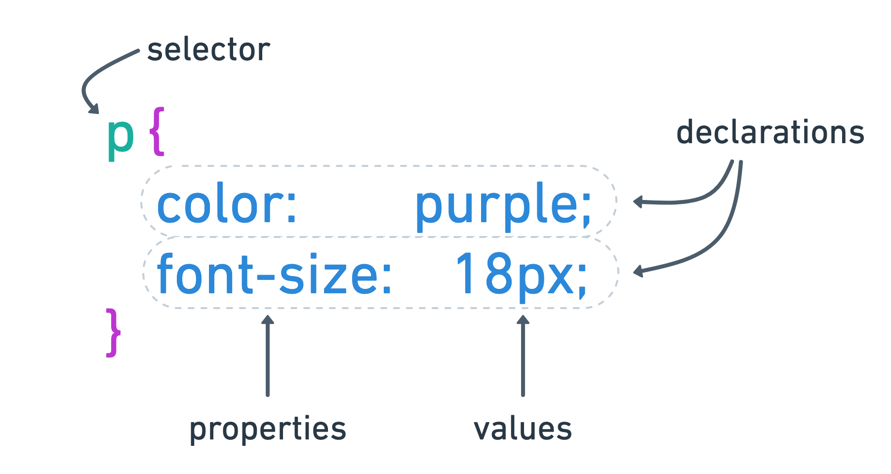
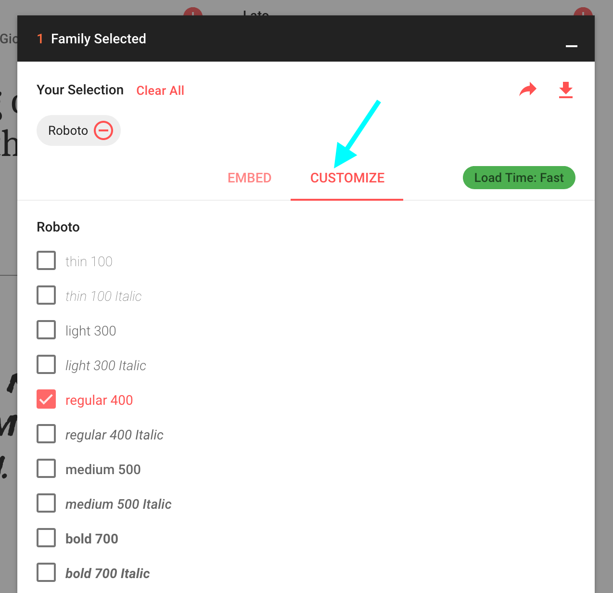

# CSS Basics

CSS requires declaring a **selector** -- an element or group of elements you want to style -- and then writing **rules** or **declarations** of what those styles should be.

Each style declaration has two parts:  the **property**, which identifies which CSS property you are using, and its **value**, which sets one of many possible appearances. The value is separted from the property with a colon (`:`) and each rule ends with a semicolon (`;`).

All the declarations for a selector are wrapped in curly brackets `{}`.

Using the CodePen you worked on in [HTML Basics](html-basics.md), let's apply some styles.  (A final example CodePen of all these styles is [available here](https://codepen.io/angeliquejw/pen/oNXppzo?editors=0100).)

## Text styles

There are several properties that affect the styling of text:

- `font-size` determines the size of a text element; there are many units for working with text in CSS. If you've mainly worked in print before, you're probably used to using points as a typographic measure. Because space on monitors and phone screens is measured in pixels, it is common to also use pixels as a measurement for type. For this reason, when you are designing in an application like Illustrator, you should configure your document to use pixels as well. In the example above, all paragraph text will be 18 pixels large.
- `font-style` controls if the text is italicized or not. Most text is not italicized by default, but to change that, you would add this declartion to your ruleset: `font-style: italic;`
- `font-weight` controls the weight or boldness of your text. The value for this property can be either a keyword like `bold` or a number like `800`. When using Google Fonts, you'll most likely want to stick to the numeric values; note that these do _not_ include a unit (`font-weight: 800;` is correct, `font-weight: 800%;` or `font-weight: 800px;` are **not correct**).
- `font-family` identifies what font should be used to display the text. Unless you use a web font (like Google Fonts), you are limited to the fonts that are on a user's computer and these can vary dramatically depending on what operating system the user has. Every `font-family` declaration should end with a generic fallback font family; see [MDN](https://developer.mozilla.org/en-US/docs/Web/CSS/font-family#Syntax) for a list of generic family names. If you're using Google Fonts, a generic font family will be recommended for each font you use.

### Web fonts
Using fonts that have been converted for web use or a service like Google Fonts or Adobe Fonts that provides web fonts gives you access to a wider array of fonts.

#### Adding to CodePen
Check out this Pen for an example of how to add one ore more Google Fonts to your CodePen projects: https://codepen.io/angeliquejw/pen/PoqJpyZ?editors=1000

#### Customizing
When you select your Google Fonts, you're also given the option to customize the font you're using:

If you want to use the proper font weight or style, you should select those options here. You can also select additonal languages or extended alphabets on this screen.

Finally, the `text-align` property sets the horizontal alignment of your text; common values you might want to use include: `left` (the default for most text elements), `right`, `center` or `justify`.

## Colors

`color` is a property that sets the text color of an element; `background-color` sets the fill color of an element. There are many possible values that can be used for color:

- [keywords](https://developer.mozilla.org/en-US/docs/Web/CSS/color_value#Color_keywords), like `purple` 
- [RGB hexadecimal values](https://codepen.io/joshonweb/full/byLzQG)

If you want to use a color that has some transparency, then you should use a color value in the `rgba` syntax. For example, if the color you're using is `#323234` but you want it at 50% opacity, you can't get that effect using keywords or hex values; you need to use `rgba`; see an [example](https://codepen.io/angeliquejw/pen/jOPGRKy?editors=1000).

---

[↤ back](README.md#table-of-contents)
