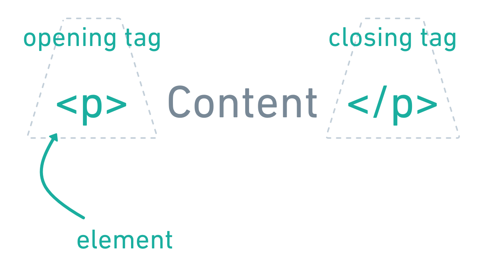

# HTML Basics

HTML is made up of elements which are incorporated into tags and wrap around your web site content.



In this example, the element is `p` -- which stands for paragraph. The element is surrounded in brackets `<>` and the content is wrapped in an opening tag and a closing tag (which is just like the closing tag but with a forward slash).

# Text elements

## Headings

```html
<h1>Heading level one</h1>
<h2>Heading level two</h2>
<h3>Heading level three</h3>
```

Heading levels go up to six (`h6`), but it's not common to need to go that deep into a strucuture.

Heading levels should _not_ be skipped; you shouldn't have an `h1` followed by an `h3`.

Every page should have one `h1` -- the main title, purpose of the page.

A page can have multiple examples of the other heading levels.

Learn more about [heading elements](https://developer.mozilla.org/en-US/docs/Web/HTML/Element/Heading_Elements).

### Semantic markup vs visual hierarchy

While in the comparison of [HTML vs CSS](html-vs-css.md) you learned that HTML is about the meaning of your content, not the presentation. However, as you see when you copy the above code into [CodePen](https://codepen.io/angeliquejw/pen/wvaqGbR), it's obvious that these headings also have default styles associated with them.

It's important to remember that you can control all presentation styles -- font size, color, etc. -- via CSS, so you can override all these styles. Browser styles should never make you choose an HTML element that is not appropriate.

This seems like a fussy distinction, but there are a lot of HTML elements and it's important to use them thoughtfully.

Learn more about the benefits of semantic HTML:

- http://vanseodesign.com/web-design/semantic-html/
- https://webaim.org/techniques/semanticstructure/

## Paragraphs

```html
<p>Your paragraph content.</p>
```

Learn more about the [`p` element](https://developer.mozilla.org/en-US/docs/Web/HTML/Element/p).

## Lists
Lists in HTML use a nested structure, which means there are tags inside of tags, like so:
```html
<ul>
  <li>A list item.</li>
  <li>Another item.</li>
</ul>
```
In this code, `ul` stands for "unordered list" and each `li` ("list item") gets a bullet marker.

In addition, there is also an _ordered_ list; the `li` code is the same, but the wrapper is `ol` instead:
```html
<ol>
  <li>A list item.</li>
  <li>Another item.</li>
</ol>
```

A numbered list is appropriate when the order of the items is important or meaningful. You'd use an `ol` for a top ten list or instructions (where finishing step 1 before step 3 is important).

Learn more about:
- [unordered lists](https://developer.mozilla.org/en-US/docs/Web/HTML/Element/ul)
- [ordered lists](https://developer.mozilla.org/en-US/docs/Web/HTML/Element/ol)
- [list items](https://developer.mozilla.org/en-US/docs/Web/HTML/Element/li)

## Links

Links represent the _hypertext_ in HTML, the ability to connect and jump around between documents. Links are created using the anchor tag, like so:

```html
<a href="https://mica.edu/">MICA</a>
```

### Attributes
Links are the first HTML element we're going to explore that require **attributes**. All HTML elements can use attributes, but links don't work without 'em. Attributes always have a name and usually also include a value. In the example above, the name is `href` and the value is `https://mica.edu/`; the value is wrapped in quotation marks.

`href` stands for "hypertext reference."

Link `href` values can point to absolute URLs (like the example above) or some other options:
- relative URLS (relative URLs point to pages or items inside your project vs external web sites or resources)
- email addresses: `<a href="mailto:aweger@mica.edu">Send email to me</a>`
- sections within your document

Learn more about the [`a` element](https://developer.mozilla.org/en-US/docs/Web/HTML/Element/a).

# Images

Like links, attributes are important to image elements. Note that this element is `img` and **not** "image".

For the following image:


you'd write the following code:

```html

```

The `src` attribute points to the image file -- which can be a relative or absolute URL.

The `alt` attribute provides a text description of the image. This text is used by screenreaders to provide context for an image and is also displayed in the browser if the image link is broken.

- the [`img` element](https://developer.mozilla.org/en-US/docs/Web/HTML/Element/Img)
- [`alt` text](https://www.webstyleguide.com/11-images.html) (See under "Providing alternatives for images")


# Container elements

## Semantic

## Generic
