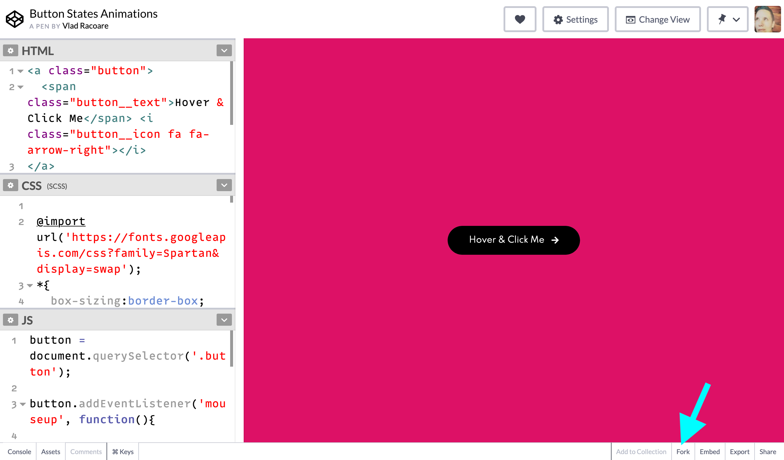

# Tools

For the purposes of this workshop, we'll be using [CodePen](codepen.io/). This is a _great_ tool for learning the basics of HTML because it:

- handles some of the complexity of setting up a web project
- allows you to immediately see the effect of your code
- makes your projects available online with zero fuss 

## Intro to CodePen

- Layout of editor: https://codepen.io/pen/tour/welcome/start 
- Settings
 - HTML -> Stuff for <head> -> "Insert the most common viewport meta tag"
- Forks
Making a "fork" of a Pen is like making a copy. You can make forks (copies) of other people's work, as well as  your own.

Keep this feature in mind if you want to create alternate versions of the project you're working on!

## Browsers + Dev Tools

It's important for all web projects to examine your work in multiple browsers because they use different rendering engines -- which means your site can look different between browsers. While in my production-level code we often check a page in as many as 30 browsers and as many different mobile devices, for the purposes of this project I'm only asking you to review your work in Google Chrome and Mozilla Firefox; both browsers are available for Windows and macOS.

Both browsers also have built-in tools to help explore HTML and CSS; see these links for more info about using the developer tools in each browser:

- Google Chrome: https://developers.google.com/web/tools/chrome-devtools/css
- Mozilla Firefox: https://developer.mozilla.org/en-US/docs/Tools/Page_Inspector/UI_Tour

---

[↤ back](README.md)
